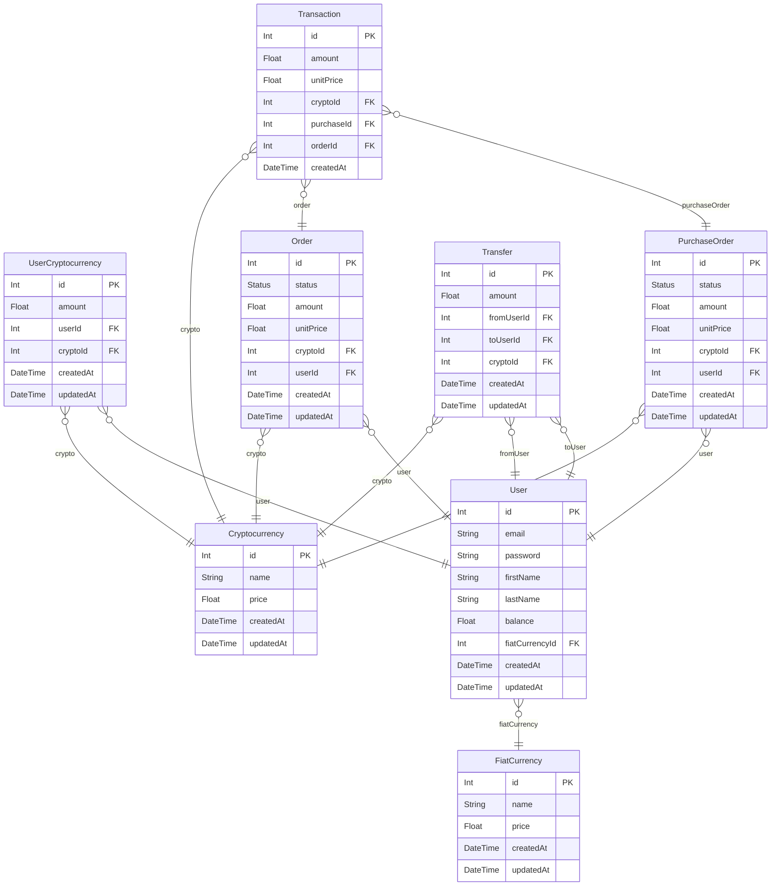

# Crypto CRUD Project
> Generated by [`prisma-markdown`](https://github.com/samchon/prisma-markdown)

- [default](#default)

## default

### `Cryptocurrency`

**Properties**
  - `id`: 
  - `name`: 
  - `price`: 
  - `createdAt`: 
  - `updatedAt`: 

### `FiatCurrency`

**Properties**
  - `id`: 
  - `name`: 
  - `price`: 
  - `createdAt`: 
  - `updatedAt`: 

### `User`

**Properties**
  - `id`: 
  - `email`: 
  - `password`: 
  - `firstName`: 
  - `lastName`: 
  - `balance`: 
  - `fiatCurrencyId`: 
  - `createdAt`: 
  - `updatedAt`: 

### `UserCryptocurrency`

**Properties**
  - `id`: 
  - `amount`: 
  - `userId`: 
  - `cryptoId`: 
  - `createdAt`: 
  - `updatedAt`: 

### `Order`

**Properties**
  - `id`: 
  - `status`: 
  - `amount`: 
  - `unitPrice`: 
  - `cryptoId`: 
  - `userId`: 
  - `createdAt`: 
  - `updatedAt`: 

### `PurchaseOrder`

**Properties**
  - `id`: 
  - `status`: 
  - `amount`: 
  - `unitPrice`: 
  - `cryptoId`: 
  - `userId`: 
  - `createdAt`: 
  - `updatedAt`: 

### `Transaction`

**Properties**
  - `id`: 
  - `amount`: 
  - `unitPrice`: 
  - `cryptoId`: 
  - `purchaseId`: 
  - `orderId`: 
  - `createdAt`: 

### `Transfer`

**Properties**
  - `id`: 
  - `amount`: 
  - `fromUserId`: 
  - `toUserId`: 
  - `cryptoId`: 
  - `createdAt`: 
  - `updatedAt`: 